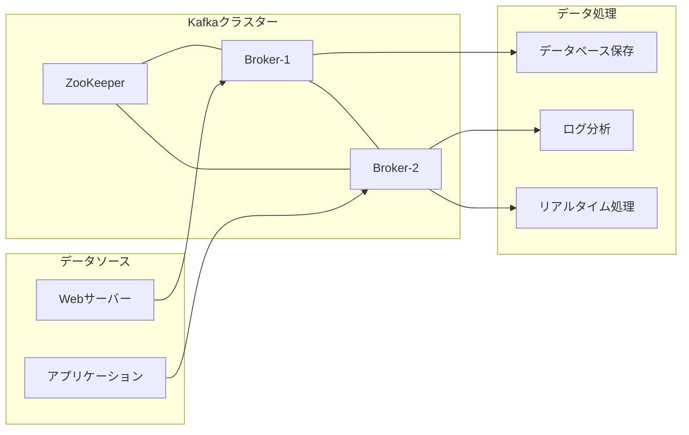

# Apache Kafka Playground

## Getting Started
```bash
docker-compose up --build -d
```

### ログを表示
```bash
docker compose logs -f

# Webサーバー
docker compose logs backend
```

### 停止
```bash
docker-compose down -v  
```

## 構成要素

### データソース（Producer）
- ログを生成するアプリケーション
- センサーデータを送信するIoTデバイス
- ユーザーアクティビティを記録するWebサーバー

### Kafka Broker
- メッセージを受け取り、保存するKafkaサーバー
- 最小構成では1台で可能
- 実運用では複数台のクラスター構成を推奨


### Consumer
- 収集したデータを処理するアプリケーション  
- データベースへの保存  
- 分析処理  

### ZooKeeper（または KRaft）
- Kafkaクラスターの管理  
- 新しいバージョンではKRaftに移行中